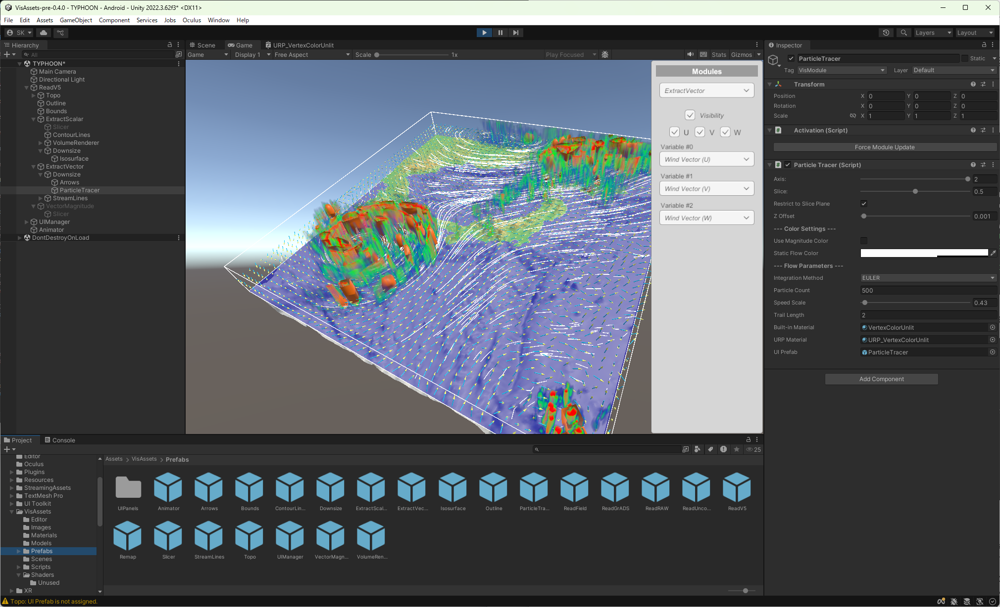

# VisAssets

 VisAssetsはUnity用の可視化フレームワークです。  
 Unityのヒエラルキーウィンドウ上でモジュールを接続することにより可視化アプリケーションを構築することができます。



## 簡単な使い方

### 動作検証済み環境
- **Unity 2022.3 LTS** (Unity 2022.3.62f3 で動作確認済み)

### インポート方法 (Unity Package Manager)

1. Unityエディタを開き、メニューから `Window` ＞ `Package Manager` を開きます。
2. 左上の `+` ボタンを押し、`Add package from git URL...` を選択します。
3. 下記のGit URLを入力し、`Add` ボタンを押します。
   ```text
   [https://github.com/kawaharas/VisAssets.git?path=/Assets/VisAssets](https://github.com/kawaharas/VisAssets.git?path=/Assets/VisAssets)
   ```
4. 依存パッケージである [RuntimeFileBrowser](https://github.com/yasirkula/UnitySimpleFileBrowser) も同様にプロジェクトへインポートしてください。
5. メニューの `Window` ＞ `TextMeshPro` ＞ `Import TMP Essential Resources` を選択し、TMPの必須リソースをインポートしてください。（※自動インポートスクリプトにより、インポート時に自動でウィンドウが開く場合はそのままインポートを実行してください）

インポート完了後、`Packages/VisAssets/Prefabs` 内のサンプルモジュールから必要なモジュールをヒエラルキーウィンドウにドラッグアンドドロップして使用します。

## モジュール間の接続ルール

- データ読込用モジュールはフィルタリングモジュールとマッピングモジュールの親になることができます。
- フィルタリングモジュールはフィルタリングモジュールとマッピングモジュールの親になることができます。
- マッピングモジュールはいずれのモジュールの親にもなることができません。

    ※モジュールが適切に接続されていない場合、そのモジュールは実行時に非アクティブ化されます。

## 新たなモジュールの開発

 テンプレートクラスを継承したC#スクリプトのオーバーライド関数に可視化ルーチンを実装することで、新たなモジュールを開発することができます。現在VisAssetsには、ReadModuleTemplate、FilterModuleTemplate、MapperModuleTemplateの3種類のテンプレートクラスがあります。これらは Packages/VisAssets/Scripts/ModuleTemplates 内にあります。

 1) テンプレートクラスを継承したC#スクリプトを作成します。
 2) 空のゲームオブジェクトを作成します。
 3) 2)で作成した空のゲームオブジェクトにモジュール種別に応じて下記のスクリプトおよびコンポーネントをアタッチします。

    |  |Activation.cs |DataField.cs |{YourOwnScript}.cs |MeshFilter |MeshRenderer |Material |
    |---|:-:|:-:|:-:|:-:|:-:|:-:|
    |ReadModule   | o | o | o | | | |
    |FilterModule | o | o | o | | | |
    |MapperModule | o | | o | o | o | o |

    Activation.csとDataField.csがアタッチされていない場合、テンプレートクラスはそれらを自動的にゲームオブジェクトにアタッチします。 
    シーン上で可視化結果をレンダリングするため、MeshFilterとMeshRendererをマッピングモジュールにアタッチする必要があります。
    また、マテリアルやシェーダについても適切に設定する必要があります。

 4) ゲームオブジェクトのタグ名を "VisModule" に変更します。
 5) ゲームオブジェクトをプレハブ化します。

## サンプルモジュール

|モジュール名|機能 |基底クラス |
|---|---|---|
|ReadField |テキストファイルの読み込み |ReadModuleTemplate |
|ReadV5 |VFIVE用データの読み込み |ReadModuleTemplate |
|ReadGrADS |GrADS用データの読み込み |ReadModuleTemplate |
|ReadRAW | 書式なしバイナリ（ベタバイナリ／Fortranレコードマーカー対応）ファイルの読み込み |ReadModuleTemplate |
|ReadUncompressedDICOM|圧縮なしDICOM形式の医療画像データの読み込み|ReadModuleTemplate |
|ExtractScalar |入力データからの単一成分の抽出 |FilterModuleTemplate |
|ExtractVector |入力データからの1～3成分の抽出 |FilterModuleTemplate |
|Downsize |内挿補間によるダウンサイズ |FilterModuleTemplate |
|VectorMagnitude |ベクトルデータからの大きさ（スカラー）の算出 |FilterModuleTemplate |
|Remap |格子構造の再マッピングやデータ補間 |FilterModuleTemplate |
|Bounds |データの境界線の描画 |MapperModuleTemplate |
|Outline |計算格子のワイヤーフレーム描画 |MapperModuleTemplate |
|Slicer |断面図の描画 |MapperModuleTemplate |
|Isosurface |等値面の描画 |MapperModuleTemplate |
|Arrows |ベクトル場を矢印で表示 |MapperModuleTemplate |
|Topo |地形の描画 |MapperModuleTemplate |
|VolumeRenderer |3Dテクスチャを用いたボリュームレンダリング |MapperModuleTemplate |
|ContourLines |スカラーフィールドに対する等値線（コンターライン）の描画|MapperModuleTemplate |
|StreamLines |ベクトル場に沿った流線（またはリボン）の描画（開始点をインタラクティブに指定）|MapperModuleTemplate |
|ParticleTracer |ベクトル場に沿った粒子の軌跡（流跡線）の描画（開始点を平面上に一様に指定）|MapperModuleTemplate |
|UIManager |ユーザインタフェース | |
|Animator |時間発展データのコントロール | |

## サンプルモジュールのテストに用いたデータセット

- ReadField用データ: 本パッケージに同梱 (Assets/StreamingAssets/Sample3D3.txt) 
  ※Unity Package Managerからインポートした場合、自動で配置されません。サンプルを実行する前に、`Packages/VisAssets/StreamingAssets/Sample3D3.txt` を、ご自身のプロジェクトの `Assets/StreamingAssets/Sample3D3.txt` へ手動でコピー（フォルダがない場合は作成）してください。

- ReadVFIVE用データ: [入手先](https://www.jamstec.go.jp/ceist/aeird/avcrg/vfive.ja.html) (sample_little.tar.gz, sample_big2.tar.gz)  
    sample_little.tar.gz用モジュール設定 (dynamo): Precesion: DOUBLE, Byteswap: off, Header: on  
    sample_big2.tar.gz用モジュール設定 (ABC flow): Precesion: DOUBLE, Byteswap: on, Header: on  
  
- ReadGrADS用データ: [入手先](http://cola.gmu.edu/grads/) (example.tar.gz)


## サンプルアプリケーション

サンプルアプリケーションは Assets/VisAssets/Scenes にあります。
読み込み後、Unityエディタ上で実行してください。

- ReadFieldSample.scene
- ReadV5Sample.scene
- ReadGrADSSample.scene

## ライセンス

本フレームワークは、MITライセンスをベースとした独自のライセンス（販売権の除外）の下で提供されています。
商業目的等での**有償での販売・再販を除き**、無償で自由に使用・改変・再配布が可能です。詳細は [LICENSE](LICENSE) ファイルをご確認ください。

## Citation

 宮地英生, 川原慎太郎, 
 ["ゲームエンジンを用いたVR可視化フレームワークの開発"](https://www.jstage.jst.go.jp/article/tjsst/12/2/12_59/_article/-char/ja/), 
 日本シミュレーション学会論文誌, Vol.12, No.2, pp59-67 (2020), doi:10.11308/tjsst.12.59
